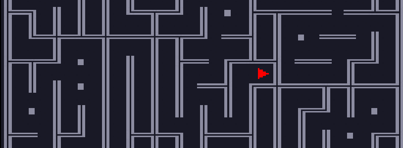

<br><br>

# Roguelike

Something in between a roguelike and a sobokan game, using classic glyph-based rendering. Just a toy project to work on in my spare time :).

Written in Rust, published in WebAssembly.

Inspired by [Into the breach](https://store.steampowered.com/app/590380/Into_the_Breach/), [Crypt of the necrodancer](https://store.steampowered.com/app/247080/Crypt_of_the_NecroDancer/) , and the [sobokan game](https://youtu.be/lPIgfYcEHr0?t=10251) Jonathan Blow is working on.

based on [this](https://bfnightly.bracketproductions.com/rustbook/chapter_0.html) tutorial to learn more about ECS & Rust. 

<br><br>

# Build 

## Wasm 
```
cargo build --release --target wasm32-unknown-unknown && wasm-bindgen target\wasm32-unknown-unknown\release\roguelike.wasm --out-dir wasm --no-modules --no-typescript
```
Then host the `\wasm` folder using vscode's live server, or anything else. 

<br><br>


